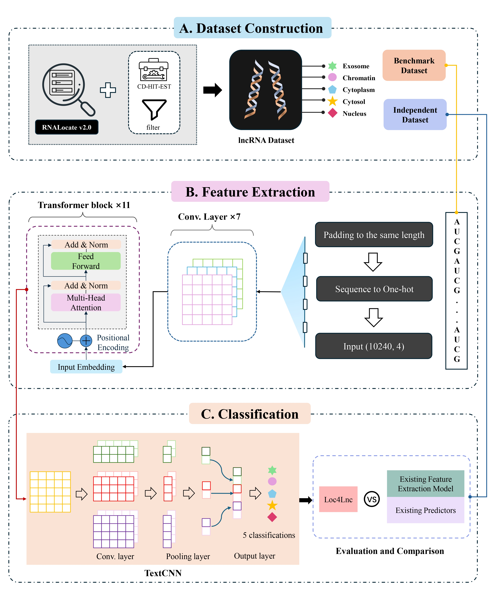

## Loc4Lnc：Accurate prediction of lncRNA subcellular  localization via enhanced RNA sequence representation

###  Introduction

**Loc4Lnc** is a deep learning framework specifically designed to predict the subcellular localization of long non-coding RNAs (lncRNAs) using sequence-based features and advanced neural network architectures. Accurate prediction of lncRNA localization is critical for understanding their functional roles and potential involvement in disease mechanisms. The model supports classification into 5 subcellular compartments, including cytoplasm, nucleus, cytosol, exosome, and chromatin. 

This repository provides the **core codebase** for Loc4Lnc, covering essential components such as **data preprocessing**, **embedding extraction**, and **model training**. The repository also includes a detailed tutorial to help users understand how to prepare input data, extract relevant features, and train the Loc4Lnc model for subcellular localization prediction.

### Environment

```bash
# Clone the repository
git clone https://github.com/tourbiIIon/Loc4Lnc.git
cd Loc4Lnc

# Install dependencies
pip install -r requirements.txt
```

### Usage

##### Run the embedding generation

```bash
cd feature
python embedding.py
```

Here, we take the independent dataset with 100 records from 5 different subcellular localizations as an example to show how to extract the feature and generate the embedding vectors of the lncRNA sequences.

##### Results of the model evaluation

```bash
cd ../model
python model.py
```

After running it, we can find the evaluation results of Loc4Lnc on the three tasks. Other predictors are evaluated using the corresponding web server, please refer to the paper for more details.

### Dataset construction

The instructions for the dataset construction can be found in [preprocess.ipynb](./preprocess_data/preprocess.ipynb).
